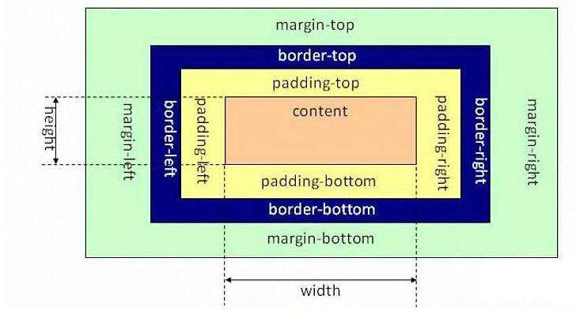

# 盒子模型

所谓 `CSS` 盒子模型，也就是用来装页面上的元素的矩形区域。

`CSS` 中的盒子模型包括 `IE` 盒子模型和标准的 `W3C` 盒子模型。

标准盒子模型`（content-box）`和 `IE` 盒子模型 `（border-box）`最主要的区别在于 `width/height` 的包含区域。

## border-box

为元素指定的任何内边距和边框都将在已设定的宽度和高度内进行绘制。

通过从已设定的宽度和高度分别减去边框和内边距才能得到内容的宽度和高度。

**`border` 和 `padding` 计算入 `width` 之内。**

计算方式：

-   宽为 `border-left` + `padding-left` + `width` + `padding-right` + `border-right`
-   高为 `border-top` + `padding-top` + `height` + `padding-bottom` + `border-bottom`

## content-box

宽度和高度分别应用到元素的内容框。

在宽度和高度之外绘制元素的内边距和边框。

**`border` 和 `padding` 不计算入 `width` 之内。**

计算方式：

-   宽为 `width`
-   高为 `height`

## padding-box

宽度和高度包含了内边距的大小。

**`padding` 计算入 `width` 之内。**

计算方式：

-   宽为 `padding-left` + `width` + `padding-right`
-   高为 `padding-top` + `height` + `padding-bottom`
