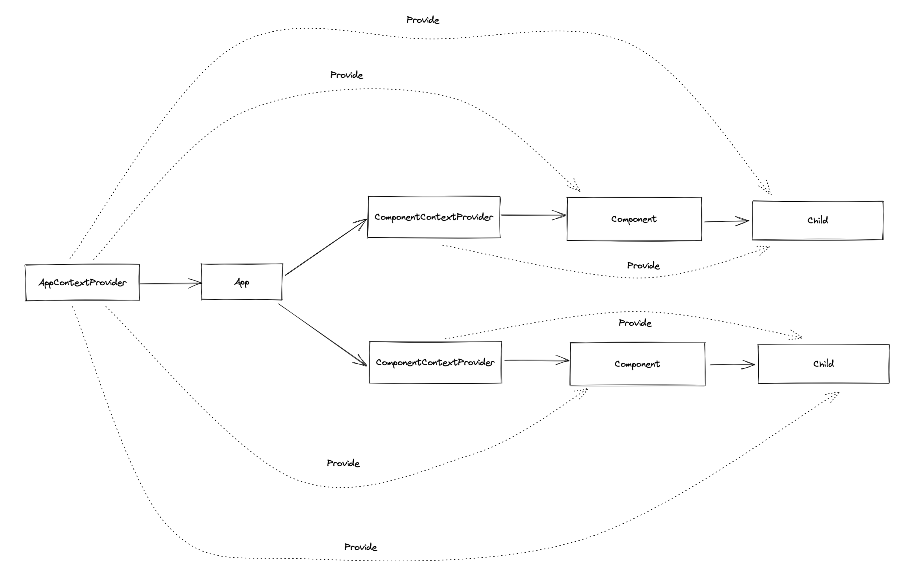

# 在 Vue 中使用 Hooks 来组织 Context

## 前言

在 Vue 中，共享组件状态通常会有几种方式

-   Props/Emit
-   Vuex
-   EventBus
-   Provide/Inject

如果我们通过 Props/Emit 的方式进行组件状态共享，则深层嵌套的状态需要一层一层的传递，这样无疑是重复工作很多，而且一处忘记传递的话会导致问题。通过 Vuex 共享状态的话，是一个好方案，但是这个方案会太重，有一定的成本。EventBus 共享的话，在每个组件都需要订阅这些状态更改的事件，相当于多个组件都要进行状态的保存。

每个方案都有自己的优缺点，在 Vue 中提供了一对 Provide/Inject 的 API，可以通过上层 Provide 下来的值来进行组件状态的共享。所以，我们如果要用 hooks 来组织和共享我们组件状态，会选用 Provide/Inject 这对 API 来实现。

## 思路

我们用一个中间组件来保存上下文状态，并进行 Provide，在下游通过 Inject 接收。如果使用 Provide / Inject 的话，为什么不直接在具体的上层组件里面保存这个上下文并进行 Provide 呢？是因为希望这个提供上下文的组件可以与组件解耦，他放置的地方可以随意组合，修改它的内容不会与组件内部原本的逻辑有冲突。

所以，在设计的时候，用法类似于 React.useContext 中提供的 ContextProvider 和 contextDispatcher 方法。通过上下文默认值创建出来的 ContextProvider 来进行状态的保存以及共享，这样做的话还可以作为一个简易的状态中心。

这样的设计可以让我们的组件分割的更好，因为状态的共享，把状态都聚合到一个上层组件中，只要在共享状态中，就能获取到这个上下文，而且上下文与其他状态可以共存。

## 设计



跟 React.useContext 创建出来的组件一致，只能获取到最近一个相同的 ContextProvider 提供的状态。在使用时需要先使用 ContextProvider 组件，在下游需要获取状态的组件使用 contextDispatcher 方法来进行获取。

多个 Hooks 创建出来的状态，会进行合并，在 contextDispatcher 获取的状态会包含所有创建出来的状态，因为是从前往后进行合并，所以后面的状态会覆盖前面。

## 实现

### ContextProvider

我们在提供状态的时候，需要用一个上层组件来进行状态的保存。

所以，我们要创建一个组件。为了有更好的类型支持，选用的是一个 `FunctionalComponent` ，来进行外层的包裹，用闭包来保存传入的 Props， 传入的 Props 可以作为初始化函数的状态。

```tsx
import { FunctionalComponent, h, defineComponent } from 'vue';

export function createContext(/*传入参数*/) {
    // 提供一个 Provider 组件
    // 使用 FunctionalComponent 包裹，可以获得更好的类型支持
    const ContextProvider: FunctionalComponent<Props> = (props, { slots }) => {
        return h(
            defineComponent({
                name: 'Provider',
                setup() {
                    const context = useValue(props);

                    const hookContextValues = selectors.reduce((merged, selector) => {
                        return Object.assign({}, merged, selector.call(null, context));
                    }, Object.create(null));

                    provide(injectionKey, Object.assign({}, context, hookContextValues));

                    return () => h(Fragment, slots.default?.());
                },
            })
        );
    };
}
```

我们在使用 Provide / Inject 的时候，我们需要用到一个 InjectionKey，所以我们先创建一个 injectionKey

```tsx
import { FunctionalComponent, h, defineComponent } from 'vue';

export function createContext(/*传入参数*/) {
    const injectionKey: InjectionKey = Symbol();

    // 提供一个 Provider 组件
    // 使用 FunctionalComponent 包裹，可以获得更好的类型支持
    const ContextProvider: FunctionalComponent<Props> = (props, { slots }) => {
        return h(
            defineComponent({
                name: 'Provider',
                setup() {
                    const context = useValue(props);

                    const hookContextValues = selectors.reduce((merged, selector) => {
                        return Object.assign({}, merged, selector.call(null, context));
                    }, Object.create(null));

                    provide(injectionKey, Object.assign({}, context, hookContextValues));

                    return () => h(Fragment, slots.default?.());
                },
            })
        );
    };
}
```

### ContextDispatcher

创建完 ContextProvider 组件，我们需要创建一个 ContextDispatcher 方法，用于获取状态，因为我们是使用 Provide/Inject，所以我们的实现很简单

```ts
function dispatch() {
    const context = inject(injectionKey);

    return context;
}
```

处理一下没有获取状态的情况

```tsx
const NO_PROVIDER = {};

function dispatch() {
    const context = inject(injectionKey, NO_PROVIDER) as Context<Value, Selectors>;

    if (context === NO_PROVIDER) {
        console.warn('The ContextProvider is never used.');
    }

    return context;
}
```

在处理完之后，我们整个实现已经完成。

```tsx
import { h, Fragment, provide, InjectionKey, inject, defineComponent, FunctionalComponent } from 'vue';
import { Selector, Context } from './interfaces';

/**
 * Compose context with hooks
 * @param useValue function for init context state
 * @param selectors hooks with context
 */
export function createContext<Props extends {}, Value extends Record<string, any>, Selectors extends Selector<Value>[]>(
    useValue: (props: Props) => Value,
    ...selectors: Selectors
) {
    const injectionKey: InjectionKey<Context<Value, Selectors>> = Symbol();

    const NO_PROVIDER = {};

    const ContextProvider: FunctionalComponent<Props> = (props, { slots }) => {
        return h(
            defineComponent({
                name: 'Provider',
                setup() {
                    const context = useValue(props);

                    const hookContextValues = selectors.reduce((merged, selector) => {
                        return Object.assign({}, merged, selector.call(null, context));
                    }, Object.create(null));

                    provide(injectionKey, Object.assign({}, context, hookContextValues));

                    return () => h(Fragment, slots.default?.());
                },
            })
        );
    };

    function dispatch() {
        const context = inject(injectionKey, NO_PROVIDER) as Context<Value, Selectors>;

        if (context === NO_PROVIDER) {
            console.warn('[vc-state] The ContextProvider is never used.');
        }

        return context;
    }

    return [ContextProvider, dispatch] as const;
}
```

## 类型

因为我们是通过 hooks 函数数组来实现类型推断的，所以我们需要用一些类型来进行类型组合。

```ts
/**
 * 根据初始化的 Context Value 派生的 hook 函数
 */
export type Selector<Value extends Record<string, any>> = (value: Value) => Record<string, any>;

/**
 * 定义 Hook Context
 */
export type DefineContext<Value extends Record<string, any>, Selectors extends Selector<Value>[]> = {
    [Key in keyof Selectors]: Selectors[Key] extends Selector<Value> ? ReturnType<Selectors[Key]> : {};
};

export type First<F extends Record<string, any>, R extends Record<string, any>[]> = [F, ...R];

/**
 * 合并 Context
 */
export type MergeContext<H extends Record<string, any>[]> = H extends [] // 如果是空数组，则返回空对象
    ? {}
    : H extends First<infer C, []> // 如果数组中有有一个值，返回第一个值
    ? C
    : H extends First<infer C, infer R> // 有多个值，则递归组合这个值
    ? C & MergeContext<R>
    : {};

/**
 * 组合后的 Context
 */
export type Context<Value extends Record<string, any>, Selectors extends Selector<Value>[]> = Value &
    MergeContext<DefineContext<Value, Selectors>>;
```

## 完整类型签名

```ts
import { FunctionalComponent } from 'vue';

declare type Selector<Value extends Record<string, any>> = (value: Value) => Record<string, any>;
declare type DefineContext<Value extends Record<string, any>, Selectors extends Selector<Value>[]> = {
    [Key in keyof Selectors]: Selectors[Key] extends Selector<Value> ? ReturnType<Selectors[Key]> : {};
};
declare type First<F extends Record<string, any>, R extends Record<string, any>[]> = [F, ...R];
declare type MergeContext<H extends Record<string, any>[]> = H extends []
    ? {}
    : H extends First<infer C, []>
    ? C
    : H extends First<infer C, infer R>
    ? C & MergeContext<R>
    : {};
declare type Context<Value extends Record<string, any>, Selectors extends Selector<Value>[]> = Value &
    MergeContext<DefineContext<Value, Selectors>>;

/**
 * Compose context with hooks
 * @param useValue
 * @param selectors
 * @returns
 */
declare function createContext<
    Props extends {},
    Value extends Record<string, any>,
    Selectors extends Selector<Value>[]
>(
    useValue: (props: Props) => Value,
    ...selectors: Selectors
): readonly [FunctionalComponent<Props, {}>, () => Context<Value, Selectors>];

export { Context, DefineContext, First, MergeContext, Selector, createContext };
```

## 例子

### CounterContextProvider

```tsx
import { defineComponent, reactive, computed, toRefs } from 'vue';
import { createContext } from 'vc-state';

function useCounter() {
    const state = reactive({
        count: 0,
    });

    const add = () => state.count++;

    const minus = () => state.count--;

    return {
        state,
        add,
        minus,
    };
}

function useDoubleCounter(context: ReturnType<typeof useCounter>) {
    const { count } = toRefs(context.state);

    const doubleCount = computed(() => count.value * 2);

    return {
        doubleCount,
    };
}

const [ContextProvider, useContext] = createContext(useCounter, useDoubleCounter);

const AddButton = defineComponent({
    name: 'AddButton',
    setup() {
        const { add } = useContext();

        return () => <button onClick={add}>add</button>;
    },
});

const MinusButton = defineComponent({
    name: 'MinusButton',
    setup() {
        const { minus } = useContext();

        return () => <button onClick={minus}>minus</button>;
    },
});

const Counter = defineComponent({
    name: 'Counter',
    setup() {
        const { state, doubleCount } = useContext();

        return () => (
            <>
                <div>normal: {state.count}</div>
                <div>double: {doubleCount.value}</div>
            </>
        );
    },
});

export default defineComponent({
    name: 'App',
    setup() {
        return () => (
            <ContextProvider>
                <AddButton />
                <Counter />
                <MinusButton />
            </ContextProvider>
        );
    },
});
```

## 总结

-   通过 hooks 来组织 context，可以聚合一组逻辑到一个 hook 中，各个 hooks 互不影响。
-   可以作为轻量级的状态管理
-   组件状态提升，轻松共享状态

## 延伸阅读

[vc-state](https://github.com/fanhaoyuan/vc-state) -- 用 hooks 来组织 context
