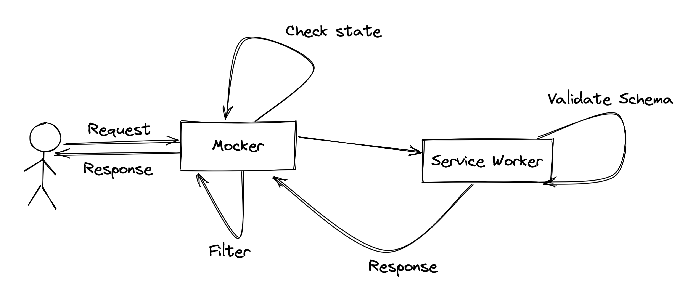

# 使用 Service Worker 模拟请求

如果我们在浏览器中想要模拟数据，我们可能会对每一个接口进行数据的模拟。
这样写的话代码侵入性很强，而且很容易接口上线之后没有修改过来，从而发生错误。



## 定义 mockFile

在模拟请求之前，我们需要在目录中进行 mock file 的编写，因为并不是所有接口都需要 mock，而且 mock 的数据也需要自定义。

mockFile 约定为 `mock/*.mock.(j|t)s`

先定义 mockFile 的数据结构

```ts
import { Rules } from 'async-validator';
import { RequestMethod } from 'fatcher';
import {
    MockjsRandomAddress,
    MockjsRandomBasic,
    MockjsRandomColor,
    MockjsRandomDate,
    MockjsRandomImage,
    MockjsRandomMiscellaneous,
    MockjsRandomName,
    MockjsRandomText,
    MockjsRandomWeb,
} from 'mockjs';

export type MockType =
    | keyof MockjsRandomBasic
    | keyof MockjsRandomAddress
    | keyof MockjsRandomColor
    | keyof MockjsRandomDate
    | keyof MockjsRandomImage
    | keyof MockjsRandomMiscellaneous
    | keyof MockjsRandomName
    | keyof MockjsRandomText
    | keyof MockjsRandomWeb;

export interface MockSchema {
    [key: string]: MockType;
}

export interface MockHeaders {
    headers?: Record<string, string>;
}

export interface MockValidatorSchema extends MockHeaders {
    params?: Rules;
    body?: Rules;
    method?: RequestMethod;
}

export interface MockResultSchema extends MockHeaders {
    body?: MockSchema;
    status?: number;
    statusText?: string;
}

export interface MockConfig {
    url: string;
    validator?: MockValidatorSchema;
    result?: MockResultSchema;
}
```

校验规则会使用 `async-validator`进行检验。
数据生成则会使用 `mockjs` 进行 mock。
定义好 mock file 之后，可以开始编写 mock 规则了

```ts
// user.mock.ts
import { defineMockConfig } from '@fatcherjs/middleware-mock/dist/defineMockConfig';

export default [
    {
        url: '/getUserInfoById',
        validator: {
            params: {
                id: {
                    type: 'string',
                    required: true,
                },
            },
        },
        result: {
            body: {
                name: 'cname', //模拟中文名称
                id: 'guid', // 模拟 guid
            },
        },
    },
];
```

这样，我们就编写好一个 mockFile，之后会用到这个文件进行 Service Worker 的生成。

## 生成 Service Worker

我们需要先制作一个 Service Worker，在浏览器注册后才可以进行 fetch 请求的拦截。
我们不可能每次都根据 mockfile 去复制粘贴到 service worker 里面，所以我们需要一个模版去生成 service worker。

### 模版

#### 生命周期

在 Service Worker 安装和激活的时候，定义好对应的方法，因为我们需要 Service Worker 始终为最新的状态。
在 Service Worker 安装的时候，我们应该跳过等待的时间，让 Service Worker 快速激活，在激活的时候调用`self.clients.claim()`来强制对所有作用域下的网页进行控制。
激活后，需要通知所有的网页这个 Service Worker 已经激活。

```ts
// 在安装的时候，取消等待
self.addEventListener('install', self.skipWaiting);

self.addEventListener('activate', async () => {
    // 强制对所有作用域下的网页进行控制
    self.clients.claim();

    const clients = await self.clients.matchAll();

    // 通知所有客户端页面，已经激活。
    clients.forEach(client => client.postMessage([client.id, 'activated']));
});
```

#### Fetch Event

要进行请求的拦截，就需要在 onFetch 这个事件里做文章。在每个请求，都会触发这一个事件。

```ts
self.addEventListener('fetch', async event => {
    // 在这里编写我们拦截的逻辑
});
```

因为并不是所有的请求都需要进行拦截，我们只需要拦截我们编写好的 mockFile 中的 url 即可。

```ts
const mockConfig: MockConfig = [
    {
        url: '/getUserInfoById',
        validator: {
            params: {
                id: {
                    type: 'string',
                    required: true,
                },
            },
        },
        result: {
            body: {
                name: 'cname', //模拟中文名称
                id: 'guid', // 模拟 guid
            },
        },
    },
];

self.addEventListener('fetch', async event => {
    // 拦截逻辑
});
```

上面的 mockConfig 是不是很眼熟，没错，就是在 mockFile 中定义好的，生成出来的一个完整的 mock 规则。在下文会看如何配合模版生成这个 mockConfig。

接下来，继续完成拦截逻辑。

```ts
const mockMap = new Map<string, MockConfig>();

for (const config of mockConfig) {
    mockMap.set(config.url, config);
}
```

先构造一个 Map，方便后续对验证规则的取值。

```ts
const request = event.request;

const [u, querystring] = request.url.split('?');

const url = u.replace(self.origin, '');

if (mockMap.has(url)) {
    // 如果有才进行 mock
}
```

解析拦截到的请求，分离出 url,对 url 进行判断，如果有需要模拟的 url 才进行模拟。

如果拦截到请求，则需要对这个请求进行规则的验证。

```ts
const { validator, result } = mockMap.get(url)!;

if (validator) {
    const { method = 'GET', params, body } = validator;

    // 先验证请求方法是否正确。
    if (request.method !== method) {
        // 如果不是正确的 请求方法， 返回405
        event.respondWith(
            new Response(null, {
                status: 405,
                statusText: 'Method Not Allowed',
            })
        );
        return;
    }

    // 验证请求参数是否正确
    if (params) {
        const requestParams = Object.fromEntries(new URLSearchParams(querystring));

        try {
            await new Schema(params).validate(requestParams);
        } catch (error) {
            // 如果验证失败，则返回客户端请求失败 400.
            event.respondWith(
                new Response(null, {
                    status: 405,
                    statusText: 'Bad Request',
                })
            );
            return;
        }
    }

    // 验证请求体是否正确

    const contentType = request.headers.get('content-type')!;

    // 因为每个请求体并不完全一致，要根据请求头中的`content-type`确定是什么类型

    // 如果是 GET、HEAD 请求 忽略 body 的验证（规范中 GET、HEAD是无 BODY）
    if (!['GET', 'HEAD'].includes(request.method) && body) {
        let requestBody;

        if (contentType.includes('application/json')) {
            requestBody = await request.json();
        } else if (contentType.includes('multipart/form-data')) {
            //    const formData  = await request.formData();
            // TODO.
        } else if (contentType.includes('application/x-www-form-urlencoded')) {
            requestBody = Object.fromEntries(new URLSearchParams(await request.text()));
        }

        try {
            await new Schema(body).validate(requestBody);
        } catch (error) {
            event.respondWith(new Response(null, { status: 400, statusText: 'Bad Request' }));
            return;
        }
    }

    //通过验证后，模拟数据
    let data = null;

    if (result?.body) {
        data = Object.create(null);

        for (const [key, value] of Object.entries(schema)) {
            data[key] = mockjs.Random[value]();
        }

        return data;
    }

    event.respondWith(
        new Response(
            JSON.stringify(data),
            responseInit(200, {
                headers: {
                    'content-type': 'application/json',
                },
            })
        )
    );
}
```

到这里，我们就完成了 Service Worker 模版。

### 插入 mock config

我们要根据 mockFile 来生成 Service Worker 模版，所以我们要把上文的 mockConfig 去除。

```ts
// 去除这一段
const mockConfig: MockConfig = [
    {
        url: '/getUserInfoById',
        validator: {
            params: {
                id: {
                    type: 'string',
                    required: true,
                },
            },
        },
        result: {
            body: {
                name: 'cname', //模拟中文名称
                id: 'guid', // 模拟 guid
            },
        },
    },
];

// 修改为

/** Inject Mock Schema Code */
```

根据`/** Inject Mock Schema Code */`这个 flag 注释，我们可以解析 Mock File 后，使用 node 来进行修改。

```ts
// cli.ts
const paths = await glob(`${process.cwd()}/**/*.mock.(j|t)s`);

let configs: MockConfig[] = [];

for await (const p of paths) {
    const config = await resolveConfig(p);
    configs = configs.concat(config);
}

const sw = await generator(configs);

fs.writeFileSync(path.resolve(cwd, 'sw.js'), sw);
```

通过 glob 匹配所有的 mockFile，对每个 mockFile 进行解析。

```ts
// resolveConfig.ts
let config: MockConfig[] = [];

if (path.endsWith('.ts')) {
    const file = await bundle(path, 'cjs', true);

    await temporary(file, temporaryPath => {
        config = require(temporaryPath).default;
    });
}

if (path.endsWith('.js')) {
    config = require(path);
}

return config;
```

对不同类型的文件进行不同的处理，因为是支持 `.ts`文件，所以要把 ts 文件打包为 js 文件。所以需要安装 esbuild 来进行处理。

```ts
import { build, Plugin } from 'esbuild';
import * as path from 'path';

/**
 * Bundle a `.ts` file to `.js` file
 */
export async function bundle(entry: string, format: 'cjs' | 'esm' = 'cjs', external = true) {
    const plugins: Plugin[] = [];

    if (external) {
        plugins.push({
            name: 'externalize-deps',
            setup(b) {
                b.onResolve({ filter: /.*/ }, args => {
                    const id = args.path;
                    if (id[0] !== '.' && !path.isAbsolute(id)) {
                        return {
                            external: true,
                        };
                    }
                });
            },
        });
    }

    const { outputFiles } = await build({
        entryPoints: [entry],
        outdir: 'out.js',
        write: false,
        platform: 'node',
        bundle: true,
        format,
        plugins,
    });

    return outputFiles[0].text;
}
```

通过打包后，我们可以解析 ts 里面的模块，把所有的 mockFile 解析后，组成一个大的 MockConfig 数组，插入到 Service Worker 模版中。

```ts
const sw = path.resolve(__dirname, '../serviceWorker/sw.ts');

// 插入到这个 flag 中
const injectedFile = (await fs.readFile(sw, 'utf-8')).replace(
    '/** Inject Mock Schema Code */',
    `const mockConfig = ${JSON.stringify(configs, null, 4)}`
);

let file = '';

await temporary(
    injectedFile,
    async temporaryPath => {
        file = await bundle(temporaryPath, 'esm', false);
    },
    '.ts'
);

return file;
```

到这里，生成 Service Worker 的步骤已经全部完成。可以开始进行测试数据模拟了。

## 注册 Service Worker

在拦截请求之前，我们需要在页面上注册这个生成好的 Service Worker。

```ts
// register.ts
export function register(url: string) {
    return navigator.serviceWorker.register(`${url}?${Date.now()}`, { scope: './' });
}
```

为什么要加一个时间戳，除了能保持所有的 Service Worker 都是最新的版本，还有是要保证 Service Worker 中所有的生命周期都要触发。下文可以看到这里的用处。

## Service Worker 状态等待

Service Worker 在初次注册，还没有被激活的时候，是无法拦截到这个时间段所发出的请求。这时候，应该阻塞所发出的请求，在等待 Service Worker 激活成功后，再释放之前所发送的请求。

因为使用的的是 fatcher 来发送请求，则可以定义一个中间件做 Service Worker 激活状态的检查。

```ts
import { Middleware } from 'fatcher';

// Service Worker 是否为激活状态。
let isActive = false;

// 监听激活状态的改变
const mounted = (event: MessageEvent) => {
    if (event.data && Array.isArray(event.data) && event.data[1] === 'activated') {
        isActive = true;
    }

    navigator.serviceWorker.removeEventListener('message', mounted);
};

navigator.serviceWorker.addEventListener('message', mounted);

// 定义中间件
export function checker(): Middleware {
    return {
        name: 'fatcher-middleware-service-worker-checker',
        async use(context, next) {
            // 所有的 Mock 请求应该等待激活状态后发送
            if (!isActive) {
                // 阻塞所有请求
                await new Promise(resolve => {
                    // 每秒钟进行检查。
                    const check = () => {
                        console.log('当前 Service Worker 是否激活：', isActive);
                        if (isActive) {
                            resolve(true);
                            return;
                        }
                        setTimeout(check, 1000);
                    };
                    check();
                });
            }

            // 激活状态后进行请求发送
            return next();
        },
    };
}
```

通过阻塞请求发送，检查当前 Service Worker 是否为激活状态，可以达到 Service Worker 拦截所有的 fatcher 请求。

## 响应结果

```ts
import { fatcher } from 'fatcher';
import { mock } from '@fatcherjs/middleware-mock'; // 开启 mock
import { json } from '@fatcherjs/middleware-json'; // 解析为 json

fatcher({
    url: '/getUserInfoById',
    method: 'GET',
    middleware: [json(), mock()],
    params: {
        id: '1049105',
    },
}).then(res => {
    console.log(res.data.id); // -> "9d3aeFCf-3d8F-b528-C083-cdADf80868DD"
    console.log(res.data.cname); // -> "罗艳"
});
```

## 集成 Vite、Webpack

集成 Vite、Webpack 的话，则可以利用构建工具的能力，自动注册 Service Worker 与监听 mock file 的修改，自动更新 Service Worker， 甚至做到热更新。

## Swagger JSON

可以通过解析 Swagger JSON, 直接生成 MockConfig 插入到 Service Worker 文件中。

## 延伸阅读

-   [fatcher](https://github.com/fanhaoyuan/fatcher)
