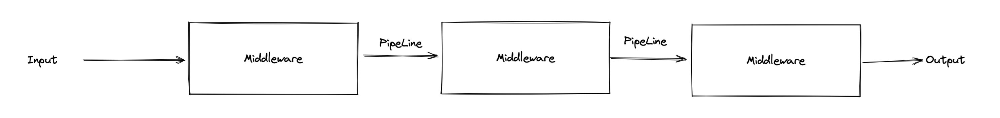
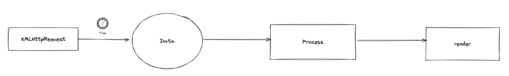
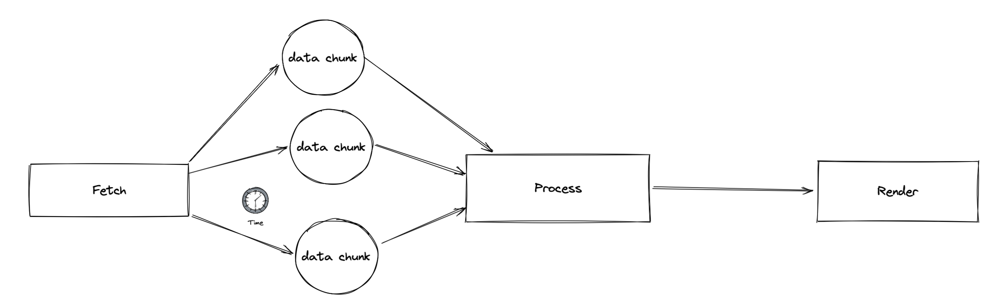
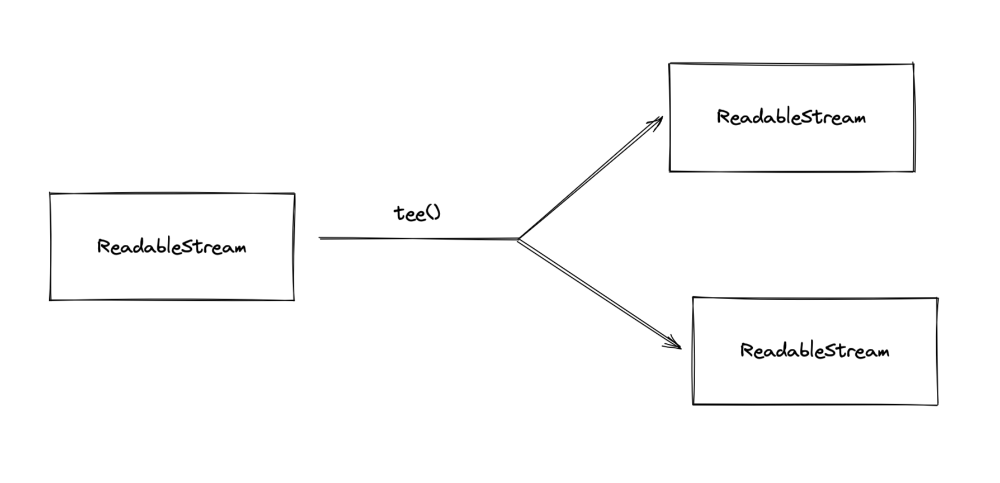

# 什么是 Streams API

流是一个很常见的概念，就是允许我们一段一段地接受和处理数据。相对于获取完整的一大块数据再进行后续处理，流只要一段一段地接收并实时处理数据，不需要等所有数据都接收完成再进行处理，缩短了整个操作的耗费时间。流在接收和处理的时候，不需要占用一大块的内存来进行数据的存储，可以在处理后释放掉已经处理好的数据，较少的内存占用是它的特点。

此外流还有管道的概念，我们可以封装一些类似中间件的中间流，用管道将各个流连接起来，在管道的末端就能拿到处理后的数据。



这些中间件就是既可以写，又可以读的流，Input 进来的是可以读的流，Output 出来的是一个可以写的流。这样就引申出来 3 个名词；

-   ReadableStream 可读流
-   WritableStream 可写流
-   TransformStream 转换流（可读可写流）

这样，就像是一个完整的数据处理流水线。

现在 Streams API 已经在浏览器上逐步实现，能用上流处理的 API 想必也会越来越多，Fetch API 就是最早一批使用 Stream API 的。

## 使用 Streams API

Streams API 赋予了 fetch 请求以片段处理数据的能力，让我们可以从网络中一段一段的接收数据并实时处理。而在 XMLHttpRequest 时代，我们需要等待浏览器把数据完整地接收后，转换为我们需要的格式，然后我们才能进行处理。



现在有了 Streams API , 我们一段一段的接收 TypedArray 的二进制数据，通过对这些底层数据的处理，组合成我们所需要的数据，大大地提高了我们在网络传输到完成处理数据的效率。



## 如何产生数据流

说了这么多，我们如果去生成一个提供数据的流呢？因为没有数据，无论怎样强大，也是没有用处的。

```ts
const response: Response = await fetch('https://bar.com/foo');

console.log(response.body); // ReadableStream
```

从上文可以知道，我们可以通过 fetch 请求来获取到这个流，在发起 fetch 请求之后，我们可以得到一个 Response 对象，这个 Response 对象中的 body ，就是一个 ReadableStream。

## ReadableStream

一个 ReadableStream 有下列 API:

-   locked 是否锁定到 reader
-   cancel() 放弃读取流
-   getReader() 获取一个 reader
-   pipeThrough() 进行管道传输
-   pipeTo() 交给最终的可写流
-   tee() 分流

我们要读取一个流的数据，必先有一个 reader， 所以我们要调用 getReader() 来获取一个 ReadableStreamDefaultReader 实例

### ReadableStreamDefaultReader

ReadableStreamDefaultReader 实例上提供了如下的方法：

ReadableStreamDefaultReader

-   closed
-   cancel()
-   read()
-   releaseLock()

我们使用 ReadableStreamDefaultReader 来读取流里面的数据，可以调用 read() 方法， 因为每次传输过来的数据时一段一段的，所以我们要多次调用 read() 方法。

```ts
const reader = readableStream.getReader();

(async function (reader: ReadableStreamReader<T>) {
    const { value, done } = await reader.read();

    if (done) {
        return;
    }

    console.log(chunk);
})(reader);
```

其中 value 参数为这次读取得到的片段，它是一个 Uint8Array，通过循环调用 reader.read() 方法就能一点点地获取流的整个数据；

而 done 参数负责表明这个流是否已经读取完毕，当 done 为 true 时表明流已经关闭，不会再有新的数据，此时 value 的值为 undefined。

#### 取消读取

假如我们在读取流的过程中不想再读取数据，我们可以调用 cancel() 方法。调用了之后，这个流就不能再被读取。

#### 释放读取锁

releaseLock() 方法用于释放 reader 对流的锁定。

#### closed

这个是一个 Promise , 它会在流被释放或者是读取完成后 resolve/reject，所以我们可以监听到读取结束的状态。

```ts
const reader = readableStream.getReader();

reader.closed.then(
    () => {
        console.log('读取完成了');
    },
    () => {
        console.log('读取错误了');
    }
);
```

### 分流

因为一个可读流只能同时有一个 reader 进行操作，所以我们可以通过调用 tee() 方法，从一个未锁定的可读流分流为两个可读流。两个可读流是完全独立的。也就是说，这两个可读流的读取与锁定互不相关。



```ts
const response: Response = await fetch('https://bar.com/foo');

const [streamA, streamB] = response.body.tee();

console.log(streamA); // ReadableStream
console.log(streamB); // ReadableStream
```

我们可以利用其中一个流进行数据读取，另外一个流进行其他操作，例如获取数据的进度。

```ts
const response: Response = await fetch('https://bar.com/foo');

const [streamA, streamB] = response.body.tee();

const dataReader = streamA.getReader();

(async function (reader: ReadableStreamReader<T>) {
    const { value, done } = await reader.read();

    if (done) {
        return;
    }

    console.log(chunk);
})(dataReader);

const progressReader = streamB.getReader();

let got = 0;

(async function (reader: ReadableStreamReader<T>) {
    const { value, done } = await reader.read();

    if (done) {
        return;
    }

    const total = response.headers.get('content-length');

    got += value.length;

    console.log(got, total, got / total); // 下载进度
})(progressReader);
```

### 管道方法

pipeTo() 和 pipeThrough() 方法是两个管道方法。可以将当前流指向其他流，最后拿到处理后的数据。

pipeTo 只能指向 WritableStream, pipeThrough 只能指向 TransformStream。

## WritableStream

WritableStream 是一个流的终点。它与 ReadableStream 的原理大致相同，区别是它的数据是写入的，ReadableStream 是读取的。

## TransformStream

TransformStream 是一个可读可写流，它是数据管道中的中间件，属于数据中间层的转化。TransformStream 内部会有一个 ReadableStream 和一个 WritableStream。这样的结构让它可以承上启下，上文读取 ReadableStream 的数据，然后写入到 WritableStream 中。

## 结语

到这里我们已经把 Streams API 中所提供的流浏览了一遍，目前 Streams API 的支持度不算太差，主流浏览器都支持了 ReadableStream，读取流已经不是什么问题了，可写入的流使用场景也比较少。相信在未来，流的应用场景会越来越广泛的。

## 延伸阅读

-   [深入 Fetch API](./FETCH.md)
-   [caniuse](https://caniuse.com/streams)
-   [mdn](https://developer.mozilla.org/zh-CN/docs/Web/API/Streams_API)
